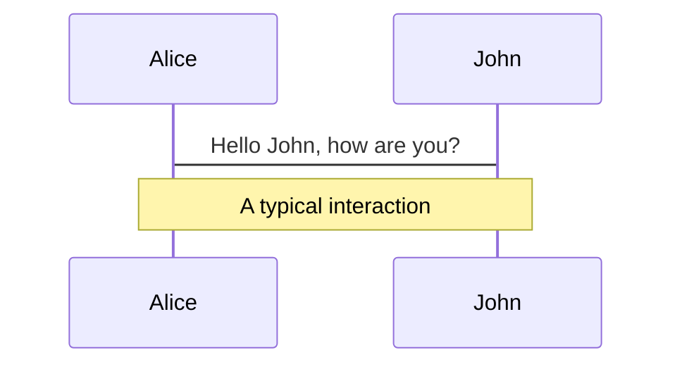
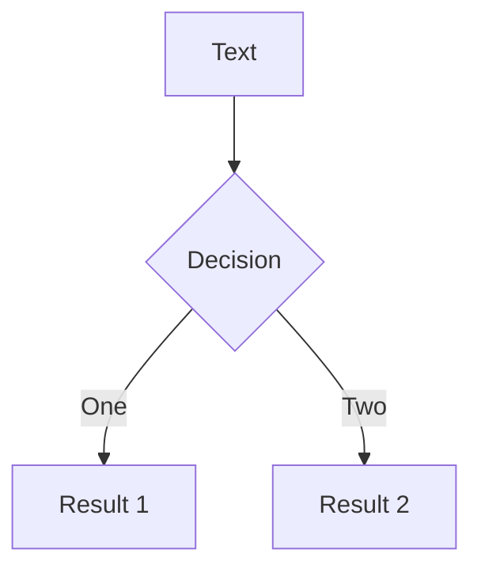
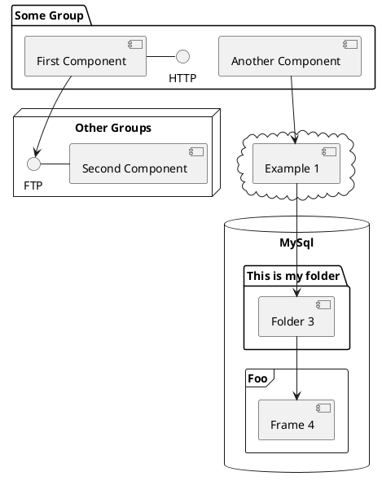

# Sablier

Scale to Zero

<div class="abs-br m-6 flex gap-2">
  <a href="https://github.com/acouvreur/sablier" target="_blank" alt="GitHub"
    class="text-xl slidev-icon-btn opacity-50 !border-none !hover:text-white">
    <carbon-logo-github />
  </a>
</div>

---
layout: image-right
image: /sablier-github.png
---

# What is Sablier?

<style>
.sablier {
  color: #ffd05b;
  font-weight: bold;
  text-decoration: underline;
}
.strategy {
  font-weight: bold;
}
.go {
  color: #00ADD8
}
.description {
  opacity: 0.8
}
.features {
  font-size: 1rem
}
</style>

<p class="description">
<span class="sablier">Sablier</span> is an API written in <span class="go">Go</span> to start containers for a given duration
</p>


<v-clicks>

### Features

</v-clicks>

<br/>
<div class="features">

<v-clicks>

- ⏳️**Session** - duration is extended after each call
- 💡**Strategies** - dynamic and blocking strategies
- 🛠 **Providers** - docker, swarm, kubernetes etc.
- 🔎 **Discovery** - find containers by labels/names
  ```bash
  docker run --label sablier.enable=true whoami
  ```
- 🔌**Integration** - reverse proxy integration with Traefik, Nginx, Caddy and more

</v-clicks>
</div>
---

#  With a waiting page (Dynamic strategy)

<video controls>  
  <source src="/dynamic-strategy-demo.mp4" type="video/mp4">
</video>

---

# Hanging the request until the container is running

<video controls>  
  <source src="/blocking-strategy-demo.mp4" type="video/mp4">
</video>

---
layout: image
image: /then-what.jpeg
---

<style>
h1 {

}
</style>

# Then what?

---
layout: statement
---

# Reverse Proxy integration 


---

# Deploying a simple service on Traefik

```yaml {all|2-3|13-|all}
services:
  proxy:
    image: traefik:2.9.1
    command:
      - --entryPoints.http.address=:80
      - --providers.docker=true
    ports: ["80:80"]
    volumes:
      - '/var/run/docker.sock:/var/run/docker.sock'

  whoami:
    image: containous/whoami:v1.5.0
    labels:
      - traefik.enable
      - traefik.http.routers.whoami.rule=PathPrefix(`/whoami`)
```

---

# Load the service

Access the website

---

# Integration with Traefik on Docker

```yaml {all|6|8-11|13-16|all}
services:
  proxy:
    image: traefik:2.9.1
    command:
      - --experimental.plugins.sablier.moduleName=github.com/acouvreur/sablier
      - --experimental.plugins.sablier.version=v1.3.0
      - --entryPoints.http.address=:80
      - --providers.docker=true
      - --providers.file.filename=/etc/traefik/dynamic-config.yml
    ports: ["8080:80"]
    volumes:
      - '/var/run/docker.sock:/var/run/docker.sock'
      - './dynamic-config.yml:/etc/traefik/dynamic-config.yml'
    labels:
      - traefik.http.middlewares.dynamic.plugin.sablier.group=demo
      - traefik.http.middlewares.dynamic.plugin.sablier.sablierUrl=http://sablier:10000
      - traefik.http.middlewares.dynamic.plugin.sablier.sessionDuration=1m
      - traefik.http.middlewares.dynamic.plugin.sablier.dynamic.theme=hacker-terminal

  sablier:
    image: acouvreur/sablier:v1.3.03
    volumes: ['/var/run/docker.sock:/var/run/docker.sock']

  whoami:
    image: containous/whoami:v1.5.0
```

<Arrow x1="700" y1="300" x2="545" y2="245" />

---

# Next steps

Proxy Wasm
WASI, proxy wasm with envoy, etc.

<div grid="~ cols-2 gap-4">
<div>

You can use Vue components directly inside your slides.

We have provided a few built-in components like `<Tweet/>` and `<Youtube/>` that you can use directly. And adding your custom components is also super easy.

```html
<Counter :count="10" />
```

<!-- ./components/Counter.vue -->
<Counter :count="10" m="t-4" />

Check out [the guides](https://sli.dev/builtin/components.html) for more.

</div>
<div>

```html
<Tweet id="1390115482657726468" />
```

<Tweet id="1390115482657726468" scale="0.65" />

</div>
</div>

<!--
Presenter note with **bold**, *italic*, and ~~striked~~ text.

Also, HTML elements are valid:
<div class="flex w-full">
  <span style="flex-grow: 1;">Left content</span>
  <span>Right content</span>
</div>
-->


---
class: px-20
---

# Themes

Slidev comes with powerful theming support. Themes can provide styles, layouts, components, or even configurations for tools. Switching between themes by just **one edit** in your frontmatter:

<div grid="~ cols-2 gap-2" m="-t-2">

```yaml
---
theme: default
---
```

```yaml
---
theme: seriph
---
```


</div>

Read more about [How to use a theme](https://sli.dev/themes/use.html) and
check out the [Awesome Themes Gallery](https://sli.dev/themes/gallery.html).

---

# Animations

Animations are powered by [@vueuse/motion](https://motion.vueuse.org/).

```html
<div
  v-motion
  :initial="{ x: -80 }"
  :enter="{ x: 0 }">
  Slidev
</div>
```

<div class="w-60 relative mt-6">
  <div class="relative w-40 h-40">
    
    
    
  </div>

  <div
    class="text-5xl absolute top-14 left-40 text-[#2B90B6] -z-1"
    v-motion
    :initial="{ x: -80, opacity: 0}"
    :enter="{ x: 0, opacity: 1, transition: { delay: 2000, duration: 1000 } }">
    Slidev
  </div>
</div>

<!-- vue script setup scripts can be directly used in markdown, and will only affects current page -->
<script setup lang="ts">
const final = {
  x: 0,
  y: 0,
  rotate: 0,
  scale: 1,
  transition: {
    type: 'spring',
    damping: 10,
    stiffness: 20,
    mass: 2
  }
}
</script>

<div
  v-motion
  :initial="{ x:35, y: 40, opacity: 0}"
  :enter="{ y: 0, opacity: 1, transition: { delay: 3500 } }">

[Learn More](https://sli.dev/guide/animations.html#motion)

</div>

---

# LaTeX

LaTeX is supported out-of-box powered by [KaTeX](https://katex.org/).

<br>

Inline $\sqrt{3x-1}+(1+x)^2$

Block
$$
\begin{array}{c}

\nabla \times \vec{\mathbf{B}} -\, \frac1c\, \frac{\partial\vec{\mathbf{E}}}{\partial t} &
= \frac{4\pi}{c}\vec{\mathbf{j}}    \nabla \cdot \vec{\mathbf{E}} & = 4 \pi \rho \\

\nabla \times \vec{\mathbf{E}}\, +\, \frac1c\, \frac{\partial\vec{\mathbf{B}}}{\partial t} & = \vec{\mathbf{0}} \\

\nabla \cdot \vec{\mathbf{B}} & = 0

\end{array}
$$

<br>

[Learn more](https://sli.dev/guide/syntax#latex)

---

# Diagrams

You can create diagrams / graphs from textual descriptions, directly in your Markdown.

<div class="grid grid-cols-3 gap-10 pt-4 -mb-6">







</div>

[Learn More](https://sli.dev/guide/syntax.html#diagrams)

---
layout: center
class: text-center
---

# Learn More

[Documentations](https://sli.dev) · [GitHub](https://github.com/slidevjs/slidev) · [Showcases](https://sli.dev/showcases.html)
